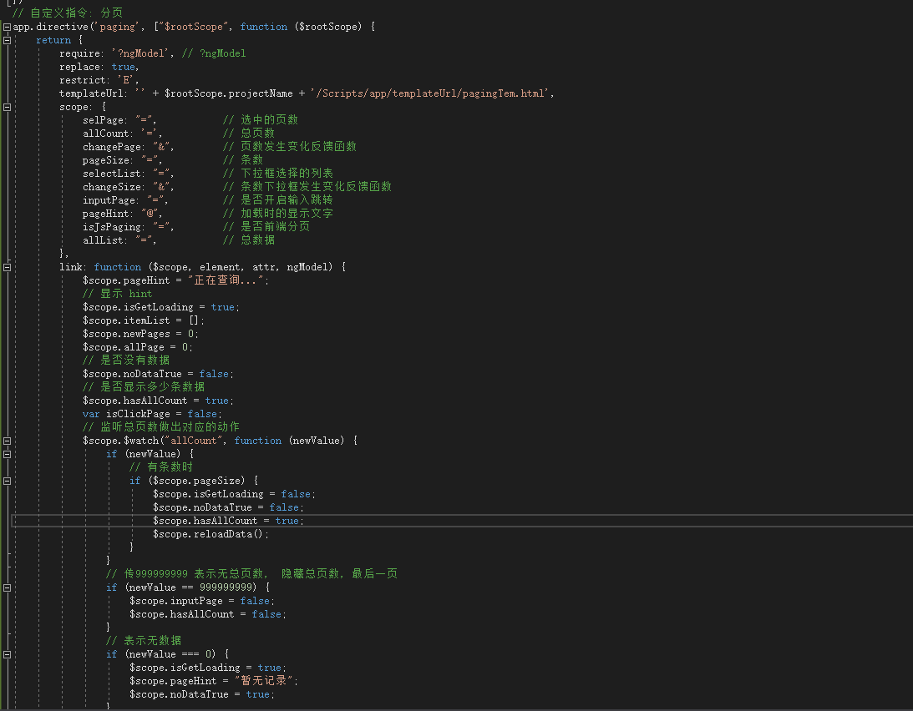
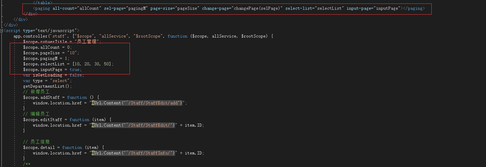
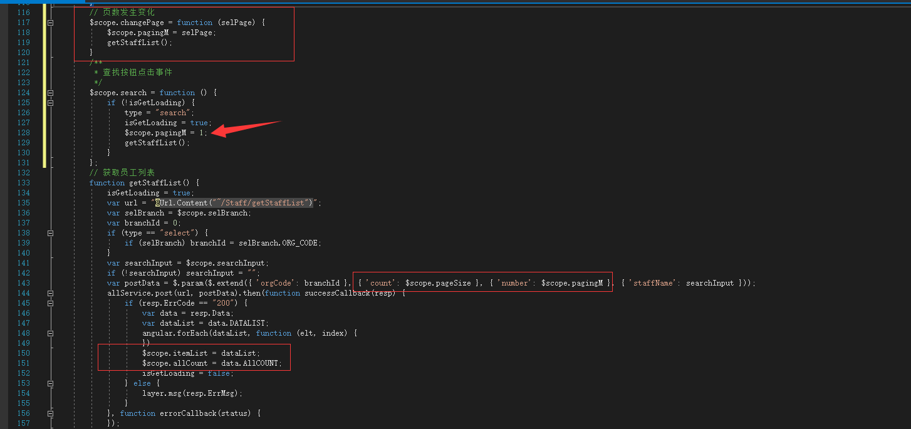
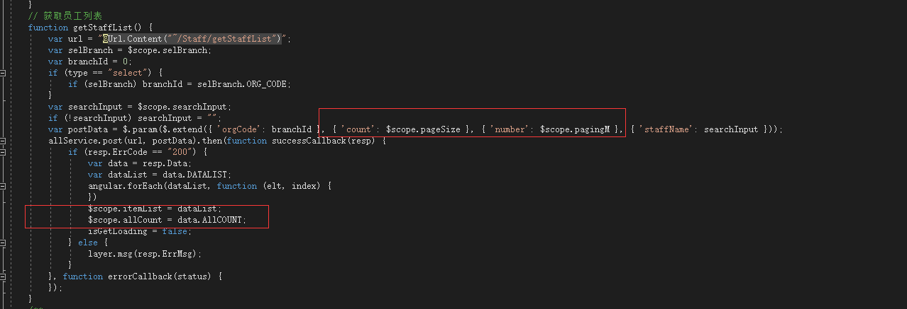
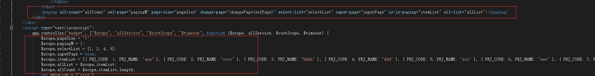
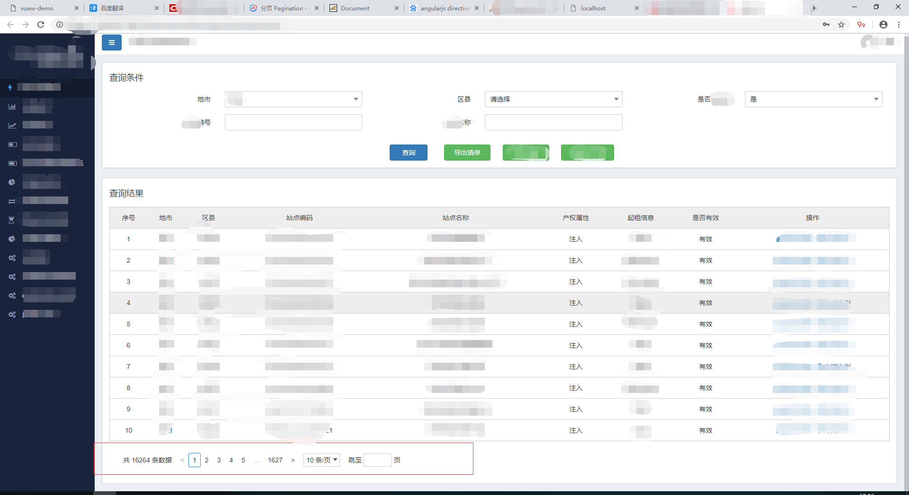

# paging
angularjs paging, angularjs 分页插件

// 自定义指令: 分页

### * 使用方法

`<paging></paging>`

参数:

` 参数名          类型            备注`

`selPage         number        // 选中的页数（必传）`

`
  allCount        number        // 总页数（必传）`

`
  changePage      function      // 页数，条数发生变化反馈函数`

`
  pageSize        string        // 条数（必传）`

`
  selectList      list          // 下拉框选择的列表`

`
  inputPage       boolean       // 是否开启输入跳转`

`
  pageHint        string        // 加载时的显示文字`

`
  isJsPaging      string        // 是否前端分页`

`
  allList         list          // 总数据`

举例:

- 服务器端分页

`<paging all-count="allCount" sel-page="pagingM" page-size="pageSize" change-page="changePage(selPage)" change-size="changeSize(pageSize)" select-list="selectList" input-page="inputPage"></paging>`

` $scope.allCount = 0;                      // 总页数 初始化` 

 `
  $scope.pageSize = "10";                   // 条数初始化`

 `
  $scope.pagingM = 1;                        // 页数初始化`

 `
  $scope.selectList = [10, 20, 30, 50];       // 下拉选择初始化`

 `
  $scope.inputPage = true;                    //是否显示输入框的初始化`

在function 里面执行获取下一页列表的方法, 参数对应的是 条数跟页数,要将获取到的 总条数赋值给 ***allCount***

<u>==注意:==</u>

 **点击搜索时 记得初始化 页数**

- 前端分页

  

​     比服务器端分页多两个参数

​	is-js-paging         填写你要循环数组的名字    itemList

​	all-list                   填写跟itemList 一样数据的另一个数组(不可以用itemList,  自己随便取一个) 

​	allCount                等于 itemList.length

​	其余的不变

- 界面展示效果

